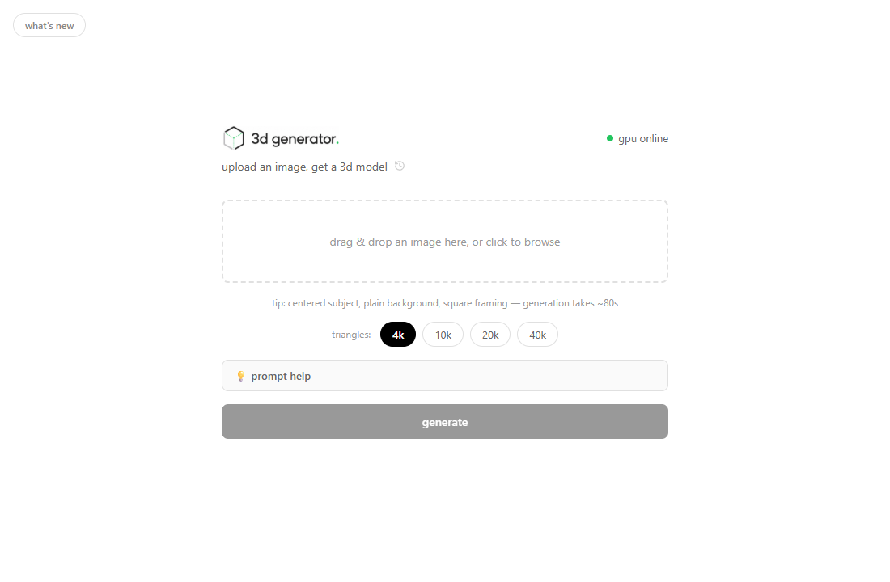
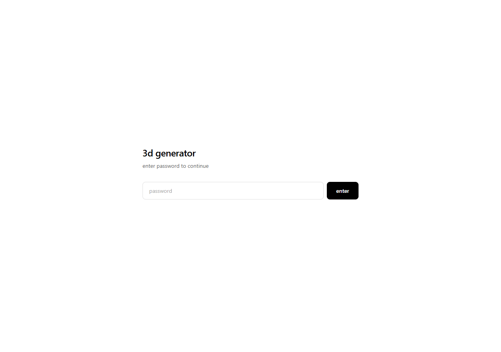
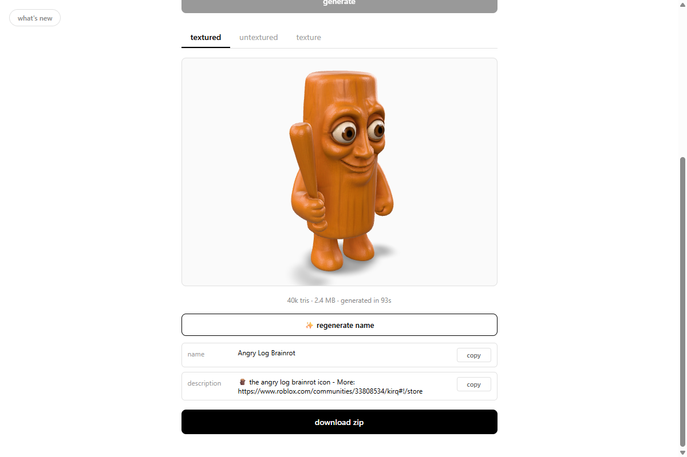

# 3d generator

A small web app that turns a single image into a downloadable 3D model (GLB) in about 80 seconds, powered by a local ComfyUI + Hunyuan3D 2.1 pipeline running on my own GPU.

Built so a couple of friends could drop in an image, watch real-time progress, and pull down a textured `.glb` they can open in Blender, Unity, or Roblox Studio.



## What it does

- **Image → 3D model** — upload PNG / JPG / WEBP (or paste from clipboard), get back a textured GLB, an untextured GLB, and the raw texture map (PNG)
- **Prompt helper** — describe a rough idea and get a polished name / description / image-generation prompt back from a local Ollama model, built to the project's backpack/UGC generation rules; plus a one-click "research prompt" preset to paste into Claude / ChatGPT / Gemini with web search
- **Triangle count presets** — pick mesh density (4k / 10k / 20k / 40k); the choice persists and shows as a badge in history
- **Model stats** — every result shows triangle count, file size, and generation time
- **Live GPU status** — the frontend pings the backend, which pings the GPU host; the dot in the header goes green when the rig is reachable, red when it's offline (powered down, network issue, ComfyUI restarting). The Generate button auto-disables when offline so users don't queue jobs that can't run.
- **Async job queue** — multiple friends can submit at once. Jobs run one at a time on the GPU; everyone else sees their queue position and an ETA computed from a rolling ~80s per-job estimate.
- **Real-time progress** — the backend holds a persistent WebSocket to ComfyUI, mapping per-node progress events back to the user's job and pushing percentage + current stage to the browser (polled every 2s).
- **Persistent history** — every generation is stored on disk; users can re-open any past result in the 3D viewer or download the zip later without re-running the workflow.
- **Three preview tabs** — textured model, untextured mesh, and the standalone texture map, all rendered in-browser with Google's `<model-viewer>` web component.
- **Shared-password auth** — signed cookie via `itsdangerous`, 7-day session.

| password gate | finished generation |
| --- | --- |
|  |  |

## Architecture

```
┌────────────────┐    HTTPS     ┌────────────────────┐    HTTP + WS    ┌─────────────────┐
│  Browser       │ ───────────► │  FastAPI (Linux)   │ ──────────────► │  ComfyUI (GPU)  │
│  vanilla JS    │              │  - auth            │                 │  Hunyuan3D 2.1  │
│  model-viewer  │ ◄─────────── │  - queue worker    │ ◄────────────── │  on RTX GPU     │
└────────────────┘   poll 2s    │  - WS progress map │   per-node      └─────────────────┘
                                │  - history (JSON)  │   progress
                                └────────────────────┘
```

- **Backend** — FastAPI, async queue worker (`asyncio.Queue`), a `gpu_lock` that serializes ComfyUI jobs and Ollama prompt-help calls so they never compete for VRAM, `httpx` for ComfyUI REST, `websockets` for live progress, `itsdangerous` for cookie signing
- **Frontend** — single-file vanilla HTML/CSS/JS, no build step, Google `<model-viewer>` (self-hosted, not CDN) for GLB rendering
- **3D pipeline** — ComfyUI workflow (`backend/workflows/image_to_3d.json`) running Hunyuan3D 2.1 image-to-3D on a separate Linux GPU box
- **Prompt helper** — local Ollama (`llama3.2:3b`) on the same GPU host, called with `format: json` and `keep_alive: 0` so the model unloads after responding
- **Storage** — per-job directory on disk (`jobs/<id>/`), `history.json` as the index
- **Deploy** — Cloudflare Tunnel fronts the FastAPI app; no inbound ports exposed

## Project layout

```
backend/
  main.py              # FastAPI app, queue worker, all endpoints
  comfyui.py           # ComfyUI client: upload, submit, listen, download
  llm.py               # Ollama client, rules loader, research-prompt builder
  workflows/
    image_to_3d.json   # Hunyuan3D workflow template
frontend/
  index.html
  app.js               # auth, upload, polling, history, model-viewer wiring
  style.css
  vendor/
    model-viewer.min.js  # self-hosted, version-pinned
```

## Run it locally

```bash
python -m venv venv
venv/bin/pip install -r backend/requirements.txt

# .env at project root:
#   SITE_PASSWORD=your-password
#   SECRET_KEY=something-random
#   COMFYUI_URL=http://your-comfyui-host:8188

python -m uvicorn backend.main:app --host 0.0.0.0 --port 8090
```

Open `http://localhost:8090`. ComfyUI must be running with the Hunyuan3D 2.1 custom nodes installed.

## API

| Method | Path | Description |
| --- | --- | --- |
| `POST` | `/api/auth` | Validate password, set signed cookie |
| `GET` | `/api/check-auth` | Check existing session |
| `GET` | `/api/status` | ComfyUI online check |
| `POST` | `/api/prompt-help` | Refine a rough idea into name / description / image prompt (Ollama) |
| `GET` | `/api/research-prompt` | Static research-prompt preset to paste into an LLM |
| `POST` | `/api/generate` | Submit image + triangle count, returns `job_id` |
| `GET` | `/api/jobs/{id}` | Poll status, progress, stage, queue position, model stats |
| `GET` | `/api/jobs/{id}/files/{name}` | Serve `textured.glb` / `untextured.glb` / `texture.png` |
| `GET` | `/api/jobs/{id}/download` | Zip of all outputs |
| `GET` | `/api/history` | List past generations |
| `DELETE` | `/api/history/{id}` | Delete a past generation |

## Notes

- The queue is in-memory; jobs persist on disk but a restart clears in-flight state. Fine for a few friends, would swap to Redis/SQLite for anything bigger.
- GLB files for the untextured mesh are written directly to ComfyUI's output folder (not the history API), so the backend snapshots the directory before submission and diffs after to find the new file — with an HTTP fallback when the filesystem isn't reachable.
- App `.html`/`.js`/`.css` responses send `Cache-Control: no-cache` so users behind the Cloudflare tunnel pick up frontend updates immediately; version-pinned vendor libs (`/vendor/`) and immutable per-job files are cached hard instead.
- The Linux backend reaches the GPU host by **hostname**, not a DHCP-assigned IP — see `CLAUDE.md` → Deployment for why.
- See [`CHANGELOG.md`](CHANGELOG.md) for the release history.
